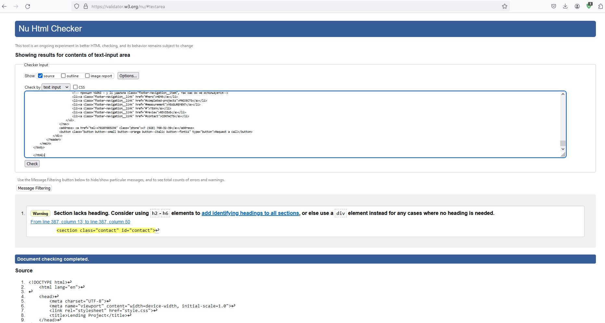

Практические задания на курсе "Профессия Fullstack веб-разработчик на JavaScript и PHP" (Модуль 20. Стандарты написания кода и общие подходы).

# Список внесённых доработок

## Принцип DRY

К селекторам .header, .completed-projects и .footer добавила .black-form, так как значение свойства background-color у них одинаковое. Соответственно, в последующем коде удалила background-color у селектора .black-form.

Было:

```
.header,
.completed-projects,
.footer {
    background-color: #131313;
}

.black-form {
    background-color: #131313;
    -webkit-box-shadow: 0px 30px 30px 0px rgba(0, 0, 0, 0.05);
            box-shadow: 0px 30px 30px 0px rgba(0, 0, 0, 0.05);
    width: 506px;
    margin-top: -12px;
    padding: 27px 50px
}

```

Стало:

```
.header,
.completed-projects,
.footer,
.black-form {
    background-color: #131313;
}

.black-form {
    -webkit-box-shadow: 0px 30px 30px 0px rgba(0, 0, 0, 0.05);
            box-shadow: 0px 30px 30px 0px rgba(0, 0, 0, 0.05);
    width: 506px;
    margin-top: -12px;
    padding: 27px 50px
}

```

## Принцип KISS
Удалила 
```
margin: 0;
```
и
```
padding: 0;
```
по всей таблице стилей для больших разрешений, и указала их для всех элеменов body.

Было:
```
body {
    margin: 0;
    font-family: 'Nunito Sans', Helvetica, Arial, sans-serif;
}

body * {
    -webkit-box-sizing: border-box;
            box-sizing: border-box;
}

p {
    margin: 0;
}

.header-navigation,
.project-navigation,
.social-list,
.footer-navigation {
    list-style: none;
    display: -webkit-box;
    display: -ms-flexbox;
    display: flex;
    -ms-flex-wrap: wrap;
        flex-wrap: wrap;
    margin: 0;
}

и т.д.
```

Стало:
```
body {
    font-family: 'Nunito Sans', Helvetica, Arial, sans-serif;
}

body, body * {
    margin: 0;
    padding: 0;
    -webkit-box-sizing: border-box;
            box-sizing: border-box;
}

.header-navigation,
.project-navigation,
.social-list,
.footer-navigation {
    list-style: none;
    display: -webkit-box;
    display: -ms-flexbox;
    display: flex;
    -ms-flex-wrap: wrap;
        flex-wrap: wrap;
}

и т.д.
```


## Принцип YAGNI

У элементов списков удалила присвоенные классы, так как они не используются для стилизации.

1. в `<ul class="header-navigation">` было:

```
<ul class="header-navigation">
    <li class="header-navigation__item"><a class="header-navigation__link" href="#hero">HOME</a></li>
    <li class="header-navigation__item"><a class="header-navigation__link" href="#completed-projects">PROJECTS</a>
    </li>
    <li class="header-navigation__item"><a class="header-navigation__link" href="#measurement">MEASUREMENT</a>
    </li>
    <li class="header-navigation__item"><a class="header-navigation__link" href="#">TEAM</a></li>
    <li class="header-navigation__item"><a class="header-navigation__link" href="#review">REVIEWS</a></li>
    <li class="header-navigation__item"><a class="header-navigation__link" href="#contact">CONTACTS</a>
    </li>
</ul>
```

в `<ul class="header-navigation">` стало:

```
<ul class="header-navigation">
    <li><a class="header-navigation__link" href="#hero">HOME</a></li>
    <li><a class="header-navigation__link" href="#completed-projects">PROJECTS</a></li>
    <li><a class="header-navigation__link" href="#measurement">MEASUREMENT</a></li>
    <li><a class="header-navigation__link" href="#">TEAM</a></li>
    <li><a class="header-navigation__link" href="#review">REVIEWS</a></li>
    <li><a class="header-navigation__link" href="#contact">CONTACTS</a></li>
</ul>
```

2. в `<ul class="project-navigation">` было:

```
<ul class="project-navigation">
    <li class="project-navigation__item"><a href="#" class="project-navigation__link">Rostov-on-Don, Admiral</a></li>
    <li class="project-navigation__item"><a href="#" class="project-navigation__link">Sochi Thieves</a>
    </li>
    <li class="project-navigation__item"><a href="#" class="project-navigation__link">Rostov-on-Don Patriotic</a></li>
</ul>
```

в `<ul class="project-navigation">` стало:

```
<ul class="project-navigation">
    <li><a href="#" class="project-navigation__link">Rostov-on-Don, Admiral</a></li>
    <li><a href="#" class="project-navigation__link">Sochi Thieves</a></li>
    <li><a href="#" class="project-navigation__link">Rostov-on-Don Patriotic</a></li>
</ul>
```

3. в `<ul class="social-list">` и `<ul class="footer-navigation">` по аналогии с пунктами 1 и 2

## Принцип SOLID

Реализован на кнопках.

Было:

```

<button class="button header-button" type="button">Request a call</button>

<button class="button" type="button">CALCULATE THE COST</button>
<button class="button button-type-2" type="button">SUBMIT YOUR APPLICATION</button>


.button {
    width: 207px;
    height: 51px;
    background-color: #e3b873;
    color: white;
    border-radius: 2px;
    -webkit-box-shadow: 0px 5px 15px 0px rgba(227, 184, 115, 0.2);
            box-shadow: 0px 5px 15px 0px rgba(227, 184, 115, 0.2);
    font-size: 11px;
    font-style: italic;
    text-transform: uppercase;
    border: 0;
    font-family: inherit;
}

.header-button,
.footer-button {
    width: 160px;
    height: 37px;
}

.button-type-2 {
    border: 1px solid white;
    background-color: transparent;
    margin-left: 20px;
}

и т.д.

```

Стало:
```
<button class="button button--small button--orange button--italic button--font11" type="button">Request a call</button>

<div class="hero-buttons">
    <button class="button button--big button--orange button--italic button--font11" type="button">CALCULATE THE COST</button>
    <button class="button button--big button--transparent button--italic button--font11" type="button">SUBMIT YOUR APPLICATION</button>
</div>


.button {
    color: white;
    border-radius: 2px;
    -webkit-box-shadow: 0px 5px 15px 0px rgba(227, 184, 115, 0.2);
            box-shadow: 0px 5px 15px 0px rgba(227, 184, 115, 0.2);
    text-transform: uppercase;
    font-family: inherit;
}

.button--big {
    width: 207px;
    height: 51px;
}

.button--small {
    width: 160px;
    height: 37px;
}

.button--orange {
    background-color: #e3b873;
    border: 0;
}

.button--transparent {
    border: 1px solid white;
    background-color: transparent;
}

.button--italic {
    font-style: italic;
}

.button--normal {
    font-style: normal;
}

.button--font11 {
    font-size: 11px;
}

.button--font13 {
    font-size: 13px;
}

.hero-buttons {
    display: flex;
    gap: 20px;
    flex-wrap: wrap;
}

и т.д.
```
## Проверка на семантику и валидность верстки сайта



## БЭМ
Выполнена верстка по БЭМ.

## Линтеры
Использован линтер Beautify css/sass/scss/less.
